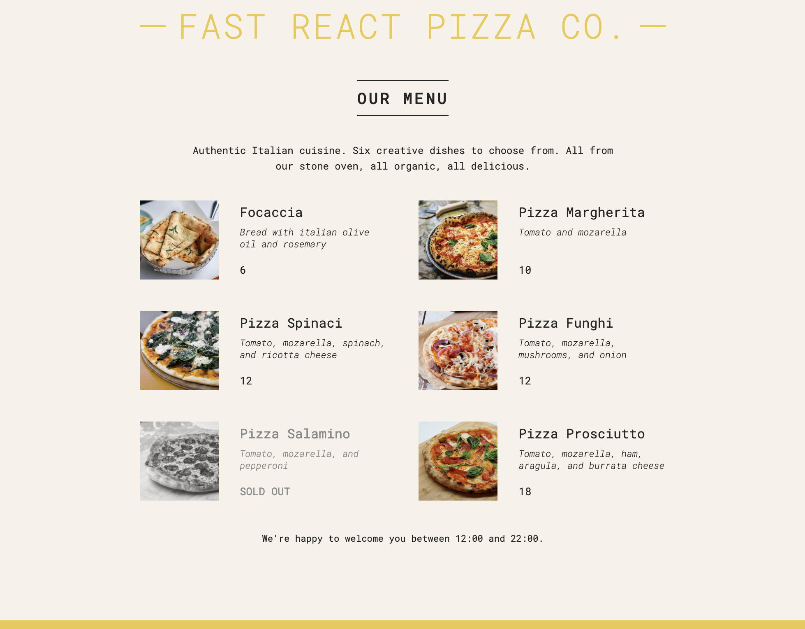

# 🍕 Fast React Pizza Co.

A simple, responsive pizza menu built using **React**. This project was created from a mockup design and focuses on rendering a list of pizzas dynamically based on provided data.



## 🚀 Features

- Built with **React functional components**
- Dynamic rendering of menu items
- Displays sold-out items visually
- Conditional rendering based on business hours
- Responsive layout with simple styling

> ⚠️ Note: Button functionality (e.g. ordering) is not implemented yet — this is a static UI mockup.

---

## 🧱 Tech Stack

- [React](https://reactjs.org/) (via `createRoot`)
- Basic CSS (custom, no frameworks)
- JavaScript ES6+

---

## 📁 Project Structure

```markdown
/public
└── index.html
└── pizzas/
├── focaccia.jpg
├── margherita.jpg
└── ... (pizza images)

src/
├── index.js # Main entry with ReactDOM
├── index.css # Basic styles
```

---

## 📦 Installation & Usage

```bash
# Clone the repository
git clone https://github.com/jguillermolopez/react-ui-from-mockup.git
cd fast-react-pizza

# Install dependencies
npm install

# Run development server
npm start
```

---

## 📝 Future Improvements

- Add functionality to the Order button
- Introduce routing for item details or checkout
- Use a state management solution (e.g. useState) to handle ordering
- Store data in a backend or JSON file

---

## 📄 License

This project is for educational/demo purposes. Feel free to fork and modify.

---

## 💡 Inspiration

This project was created from a mockup as part of a React learning exercise. It emphasizes component-driven UI development.

---

## 🙌 Acknowledgments

Thanks to _The Ultimate React Course_ by Jonas Schmedtmann on Udemy.
